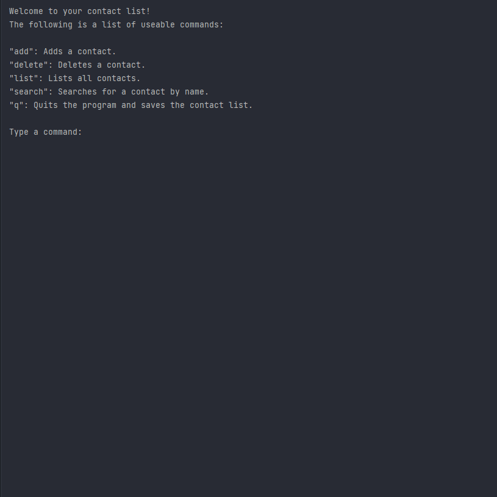

## Contact List
Program that can persistently store a list of a user’s contacts. 
Program work similarly to a command line interface, where constantly ask the user to enter one of the following commands:
````
- add: Adds a contact to the contact list.
- delete: Deletes a contact from the contact list using it's first and last name.
- list: Lists all the contacts in alphabetical order by first name.
- search: Searches for contacts by their first and last name.
- q: Quits the program and saves all of the current contacts.
````

Each time the program is executed the contacts added or deleted in previous executions are still accessible. 
Program uses to store contacts persistently `.json` file.

### Validation Phone and Email
When adding contacts ensure that all phone numbers that are entered are valid. For this project a phone number is valid 
if it is `9 digits` and only contains numbers. Email has to contain `@` and domain to be valid.

### Searching contact
When searching for contacts simply display all contacts that contain the strings used to search for first and last names.
For example, if your search strings are `first_name = "t"` and `last_name = "r"` then program displays the following names:
- Stan Right
- Tim Archer
- Thomas Rong

## Sample of the program



## Running the code

- To run the code first clone the repository using `git clone https://github.com/fortyfortyy/basic-advanced-programs-in-python.git`.
- Next `cd contact-list` and execute the `main.py` file with `python main.py` or `python3 main.py`.
