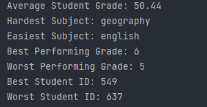

# Student Performance

A tool that can be used by the staff of a school to analyze the performance of students. Specifically, this tool will 
read the report cards of hundreds of students from .json file and display data like the average grade, the hardest 
subject, best performing grade level and more.

<p style="font-weight: bolder">This is an example of student #0's report card:</p>


```diff
{
  "id": 0,
  "grade": 5,
  "math": 34,
  "science": 58,
  "history": 34,
  "english": 26,
  "geography": 99
}
```

From the above report card, we can see that student #0 is in grade number 5, earned a mark of 34 in math, a mark of 
58 in geography etc.

## Sample of the program


## Running the code

- To run the code first clone the repository using `git clone https://github.com/fortyfortyy/basic-advanced-programs-in-python.git`.
- Next `cd student-performance` and execute the `main.py` file with `python main.py` or `python3 main.py`.
