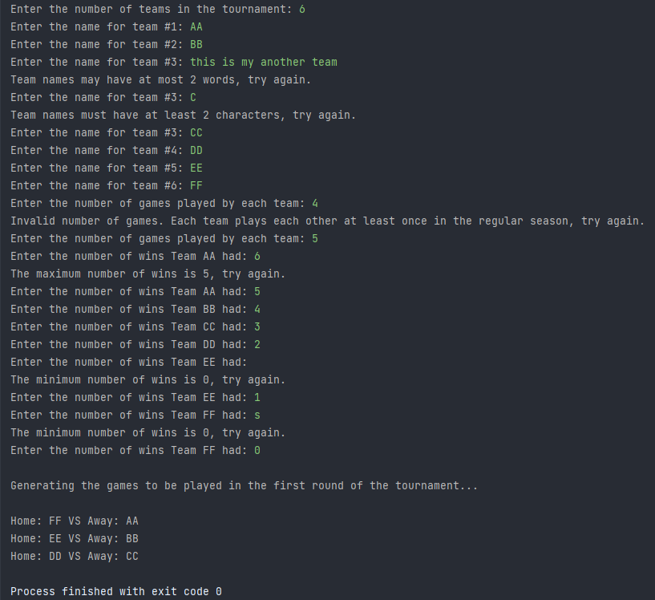

# Tournament Game Generator

Program that can schedule games that teams will play in an end of year tournament. Script is responsible for determining
the games played in the first round of the tournament.

The first game outputted contain the team with the most regular season wins, the second game should contain the team with the second most regular season wins, etc.

## Sample of the program

## Running The Code

- To run the code first clone the repository using `git clone https://github.com/fortyfortyy/basic-advanced-programs-in-python.git`.
- Next `cd tournament-game-generator` and execute the `program.py` file with `python program.py` or `python3 program.py`.
